# Design Notes: A Keymap Manifesto of Sorts

Spacecentricity is a maximalist, highly‑opinionated, and intentionally over‑engineered layout built around modal editing, thumb‑centric design, and low‑travel ergonomics. It treats the keyboard as a command environment rather than a simple text‑entry device, prioritizing fluid layer transitions, expressive shortcuts, and tightly integrated workflows over minimalism or portability.

I’ve been intermittently iterating on this layout since late 2019, gradually shaping it into a system that reflects how I actually work: heavy on modal editing, reliant on thumb‑driven modifiers, character input, and layer changes, and optimized for staying anchored to the home position. What began as a small experiment on the [ZSA Planck EZ](https://blog.zsa.io/2307-goodbye-planck-ez/) using the [Oryx web UI](https://www.zsa.io/oryx) has evolved into a (mostly) cohesive workflow that tries to balance comfort, speed, and long‑term ergonomics across multiple layers.

I finally ported the layout to a manual QMK implementation in March 2026, a long‑overdue step that let me refine the internals, clean up old compromises, and bring the design closer to what I’d always intended. My original Oryx‑based layouts had several constraints — for example, they couldn’t combine tap dances with predefined macros — so moving to QMK opened the door to far more expressive behaviors.

This page expands on the design decisions. It’s not required reading for using the layout, but it explains the ergonomics, biases, and reasoning that shaped each layer. The method to the madness lives in this document so I can refer back to my own reasoning.

## Table of Contents
- [Release Statement](#release-statement)
- [Thoughts on the Planck Form Factor](#thoughts-on-the-planck-form-factor)
- [Bias](#bias)
- [Layer Design Details](#layer-design-details)
  - [Base: Modified Dvorak](#base-modified-dvorak)
  - [Lower: Numpad](#lower-numpad)
  - [Upper: Primary Number Layer](#upper-primary-number-layer)
  - [Adjustment: Keyboard Settings](#adjustment-keyboard-settings)
  - [Function: `F1`–`F12`](#function-f1f12)
  - [Arrows](#arrows)
  - [Vim](#vim)
  - [Programming](#programming)
  - [Terminal](#terminal)
  - [Apple macOS](#apple-macos)
  - [Mouse](#mouse)
  - [Doom Classic](#doom-classic)
- [RGB Matrix for the Planck MIT](#rgb-matrix-for-the-planck-mit)

## Release Statement

This layout is an ongoing experiment in modal ergonomics, mirrored layers, and thumb‑centric design. It will continue to change as I refine it through regular use. I’m sharing this keymap so others can explore the ideas behind it, borrow what’s useful, and follow its development over time.

I’m not approaching this layout with a statistical or scientific methodology; I’m mostly making informed guesses about what should go where based on use. As a result, there may be small inconsistencies or rough edges as the design shifts and settles.

Because of its high learning curve, I don’t expect anyone to use this keymap as‑is. Some may still adopt or adapt parts of it to their own needs: porting it to a split keyboard, rearranging layers, or reshaping the workflow to match personal habits. It isn’t meant to be a universal, one‑size‑fits‑all solution; it’s a reference design intended to be customized, remixed, or cribbed from. I’m contributing it simply as another custom keymap, one that goes in the opposite direction of simplicity, for others to explore and critique.

Most people will likely be better served by something more minimal. For instance, [Miryoku](https://github.com/manna-harbour/miryoku) adapted to Planck MIT and configured with a preferred alpha arrangement. Default keymaps tend to be generic and unoptimized, so even a simple ergonomic layout is usually a meaningful improvement, especially if it moves you away from QWERTY.

## Thoughts on the Planck Form Factor

The Planck’s biggest strength is its size. A 40% unibody board is extremely portable, easy to pack, and requires only a single cable: no split halves, no extra connectors, no desk sprawl. That simplicity makes it ideal as a travel board or a compact daily driver. As a bonus, inexpensive Nintendo Switch cases or even some stethoscope cases will neatly fit the board, often with room for cables and other accessories.

The ortholinear grid also encourages a stable, centered typing posture. Because the board is so small, your hands stay close together and your thumbs can reliably reach the large keys without shifting your wrist position. Some users report increased ulnar deviation on small unibody layouts, but this varies widely. I personally don’t experience wrist twisting on the Planck, and the compact footprint actually helps me maintain a neutral posture. Split keyboards are the ergonomic rage these days, and rightfully so. However, I don’t gain much from using a split keyboard, though in general I would still recommend one for most typists if they have the option.

There’s also a meaningful difference between the two common Planck variants. The 47‑key MIT layout uses a 2u spacebar, while the 48‑key Grid layout replaces it with two 1u keys. Some people prefer the Grid version because it offers more flexibility for thumb keys and layer access, while others like the MIT layout’s simplicity and larger spacebar. Spacecentricity is designed around the MIT variant, but the underlying ideas translate well to the 48‑key version.

The biggest trade‑off is that the Planck demands heavy layer usage and rewards people who enjoy modal workflows. For users who prefer dedicated keys or who struggle with ortholinear spacing, the learning curve can feel steep. But for those who embrace layers, symmetry, and thumb‑centric design, the Planck offers a uniquely efficient and expressive platform—especially when paired with programmable firmware like QMK or [ZMK](https://zmk.dev/) for wireless support, which adds even more power (and another notch of complexity).

## Bias

Every keyboard layout bakes in assumptions about language, workflow, and ergonomics. Spacecentricity is no different. The following sections outline those intentional biases and provide context for why the layout behaves the way it does and who it’s most likely to suit.

### U.S. English-Centric

The layout is optimized around English letter frequency, English‑centric n‑grams, and punctuation patterns common in programming and Vim. Other languages will work, but the ergonomics and frequency assumptions are tuned specifically for English prose and code as indicated by the choice of the Dvorak alpha layout.

> [!IMPORTANT]
> **Operating System Keyboard Settings**
>
> On macOS, the input source must be set to **ABC – Extended**. Other layouts may alter Option‑based characters or dead‑key behavior and can produce incorrect special‑character output. This input source does not appear to conflict with system or application shortcuts and behaves similarly to the standard US layout in that regard.
>
> For Linux and Microsoft Windows, the standard US layout should work as expected.

> [!TIP]
> Light multilingual support is avaliable on the arrow‑key layers, including common Spanish punctuation `¡`, `¿`, accented vowels (via combining acute), `ñ`/`Ñ`, and related symbols. This is likely more useful for North Americans.

### Heavy Use of Layers

Most custom keymaps use only a few layers, often three or four, to keep the learning curve shallow and the cognitive load low. Spacecentricity takes the opposite approach. It has over a dozen layers, many of them bilaterally mirrored, with possibly more as the design evolves. Not every key on every layer is essential, but each layer has a clear purpose, and many exist to group related behaviors or fill unused real estate with logical themes. The result is a system that favors expressiveness and modal clarity over minimalism.

If a key or action ends up unused, misfired, or mistyped too often, I’ll eventually replace it with something more useful or disable it with a `KC_NO` “no operation” signal. Layers should earn their keep; anything that adds friction without providing meaningful value gets refined or removed.

### Right-Hand Oriented

Dvorak is naturally right‑hand dominant, and this layout leans into that by placing several high‑frequency actions and modal layers on the right side. At the same time, many modal layers — arrows, Vim, and programming n‑grams — are mirrored on the home row, allowing either hand to access the same functionality with a momentary hold. This keeps the layout more balanced in practice, reduces travel, and avoids over‑reliance on a single hand.

Any layers that aren’t already mirrored can be reoriented for left‑handed users.

### Thumb-Centric

The thumbs do a disproportionate amount of work in this layout, as is typical of many Planck keymaps. On a small ortholinear board, they are the only digits capable of pressing keys without destabilizing hand position, so Spacecentricity assigns them high‑value roles: layer access, modifiers, and frequently used symbols. This reduces lateral finger travel and keeps the alphas anchored under the home row.

Both thumbs are used symmetrically where possible, but the right thumb carries slightly more responsibility to complement Dvorak’s right‑hand bias. Momentary layer holds and tap-hold modifiers are placed under the thumbs to keep the rest of the fingers focused on text entry and editing. The goal is to make layer changes feel as natural as typing a letter, minimizing cognitive overhead and physical strain.

The biggest difference between this keymap and many others is its heavier reliance on the thumbs for entering letters, symbols, and modal actions, shifting work away from the weaker fingers and reducing overall movement.

### Vim Keys Everywhere

Navigation follows the familiar left‑down‑up‑right pattern. For example, `Home`, `Page Down`, `Page Up`, and `End` are arranged to feel natural to anyone fluent in Vim motions. Several symbol keys use tap dances to expose common Vim commands and editing patterns directly from the base layer.

This keymap is designed for users of Vim, [Neovim](https://neovim.io/), and [Emacs](https://www.gnu.org/software/emacs/) configurations that support Vim‑style editing, including Evil Mode, [Doom Emacs](https://github.com/doomemacs/doomemacs), and [Spacemacs](https://www.spacemacs.org/). It also should be suitable for editors with Vim emulation layers, such as [Visual Studio Code](https://code.visualstudio.com/download)/[VSCodium](https://vscodium.com/) and [JetBrains IDEs](https://www.jetbrains.com/ides/), as well as browser extensions like [Vimium](https://vimium.github.io/). The goal is to make modal editing and navigation feel consistent across applications, regardless of the environment.

> [!WARNING]
> **Emacs Compatibility**
>
> This layout has not been tested with Evil Mode, Doom Emacs, and Spacemacs.
> Emacs can be sensitive to rapid modifier chords and mod‑tap timing. If you rely
> heavily on `Ctrl`, `Meta`, or multi‑key sequences, you may need to adjust your QMK
> tapping settings (e.g., `TAPPING_TERM`, `PERMISSIVE_HOLD`, or `IGNORE_MOD_TAP_INTERRUPT`)
> to ensure smooth, reliable behavior.

### Tap Dances Everywhere

Tap dances are used extensively to expose extra functionality without increasing finger travel. Many symbol keys support multi‑tap or tap‑hold behaviors that surface common Vim motions, programming operators, and punctuation variants.

They’re organized in logical clusters so they’re relatively easy to internalize. When a key has room for more functionality, I’m not shy about giving it more to do, even if that introduces a bit of redundancy. I’ve also made space for specialized characters that are awkward to type or hard to remember — the ellipsis (`…`), yen/yuan (`¥`), approximation (`≈`), and various diacritics for other languages — without relying on OS menus or obscure shortcuts. These aren’t strictly necessary, but they’re the kind of small design flourishes that make the keymap feel more complete.

Here’s how I rank the typing difficulty of each tap dance:

| Action | Difficulty |
|--------|------------|
| Tap | 1 (easiest) |
| Double Tap | 3 |
| Tap-and-Hold | 4 (hardest) |
| Hold | 2 |

This ranking reflects how much precision and timing each action requires in real typing. Tap‑and‑hold is the most demanding because it relies on both timing and intent, while simple taps remain the most effortless. As a consequence, the most important or frequently used behavior is assigned to the tap, while the least critical or most consequential behavior is placed on tap‑and‑hold, since it has the lowest risk of accidental activation.

Note that the source code has support for triple tap and double-tap-and-hold dances that aren’t marked in the diagrams.

Triple tap sits outside the spectrum of general use. They’re possible, but they require enough rhythmic precision that they’re best reserved for symbols you want available without being prominent. They act as a kind of deep storage: a place for useful but infrequent characters that don’t justify occupying a more ergonomic gesture, such as `·`, the centered dot. They’re deliberate enough that accidental activation is unlikely, though they can be mistyped as a double tap followed by a single tap or vice versa. In practice, the triple tap is more of an easter egg than part of the core typing workflow.

Patterns like double‑tap‑and‑hold exist in theory, but they cross the line from ergonomics into keyboard choreography. At that point the gesture becomes harder to perform than the symbol or action is worth, so I avoid them entirely.

### Little Automations with Macros

Macros serve a different but complementary purpose to tap dances. Where tap dances expand key access through timed input patterns, macros automate multi‑step actions into a single trigger. They’re used for repeated n‑gram patterns, editor commands, and small system tasks such as opening the Trash folder on macOS.

Macros in this layout follow a few principles:

* They should reduce cognitive load, not add to it. A macro should replace a tedious sequence you already perform, not introduce a new workflow you have to remember.
* They should be predictable, easy to remember, and assist with typing flow.
* They should reduce or eliminate friction and help keep the hands anchored to home position during repetitive tasks.
* They should never compete with typing. No macro should be placed on a gesture that risks accidental activation during normal text entry.
* They should complement software, not replace it. QMK allows arbitrarily long macros, but firmware is best for short, deterministic sequences. Anything more complex belongs directly in the editor, shell, or OS.
* They should lean toward generality so the keyboard can be used across multiple systems without specific configurations.

The original ZSA Oryx‑based versions of this layout were constrained by the platform’s macro limits, which shaped how early versions were designed.[^oryx-macro-limit] Moving to QMK removed those constraints and made it possible to integrate macros more naturally with the tap‑dance system.

[^oryx-macro-limit]: As of April 2025, ZSA Oryx macros are [limited to 25 steps](https://blog.zsa.io/longer-oryx-macros/), up from the original — and frankly tiny — [5‑step limit](https://blog.zsa.io/macro-expansion/). QMK places no practical limit on macro length, though beyond a certain point software‑level automation is usually a better fit than firmware. And for the love of security, never store passwords or other sensitive data in macros. Also note that Oryx cannot combine tap dances with macros.

### Apple macOS Oriented

Apple macOS is the primary target platform for this layout, even though Linux and Microsoft Windows modes are included for cross-platform support.

With an **OS Mode** key, you can select your current operating system to get the appropriate keyboard shortcuts for copy/paste, window management, and virtual desktop/workspace commands. Special characters are also output correctly depending on the selected OS.

Additional Linux support is planned for the future.

> [!WARNING]
> Linux and Microsoft Windows support is currently untested.

## Layer Design Details

###  Base: Modified Dvorak

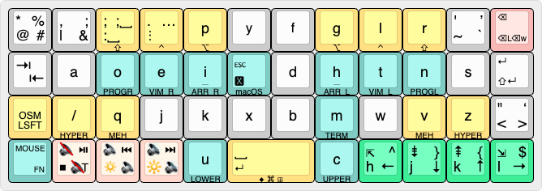

The **Base** layer packs in as much functionality as I can comfortably manage without overwhelming day‑to‑day typing. Quad tap‑dance keys aren’t ergonomically ideal, but they surface high‑use symbols on the top layer for times when I’d rather not reach into the symbol layers. Only a handful of commonly used symbols aren’t accessible directly from this layer.

#### Alpha Keys

August Dvorak devised the original [Dvorak keyboard layout](https://en.wikipedia.org/wiki/Dvorak_keyboard_layout) layout in the 1930s. While it offers many advantages over QWERTY, it also includes some letter‑placement quirks for modern computer use. For example, `i` sits off the home position while `u` sits on it, despite their relative frequencies in English. With a programmable keyboard, it becomes possible to place keys in positions that make personal sense rather than following predefined layouts.

This layer uses a modified Dvorak layout with a few intentional relocations based on relative frequencies[^English-letter-frequency]:

* `u`, `c` moved to the left and right thumbs
  * Keeps a primary vowel under the left thumb
  * Both letters are medium‑frequency in English, so neither thumb is overloaded during prose typing
  * Places Vim **undo** (`u`) under comfortable position
  * Gives the right thumb a high‑value operator (`c`) for easier change‑motions in Vim
* `i` moved to the left‑hand index home position
  * Higher-frequency vowel than `u`
  * Makes entering Vim insert mode slightly easier
* `Esc` placed on the right‑hand center home key (formerly `i`)
  * Provides a fast, symmetric way to exit Vim modes—critical in modal editing
  * Eliminates the awkward reach to the traditional top‑left corner
* `l` moved to the top row above `t` (replacing `c`)
  * Keeps a common consonant accessible without disrupting the new thumb assignments

I briefly experimented with a QWERTY layer in a multi‑alpha setup, but dropped it quickly because QWERTY feels uncomfortable to me on ortholinear and column‑staggered boards. Fortunately, muscle memory stays separate enough that I can still type QWERTY on standard keyboards without issue. Of course, YMMV juggling multiple alpha maps and physical keyboard layouts.

I’m also not using Colemak(-DH), Workman, or other modern ergonomic layouts. I originally learned Dvorak as an OS‑level setting on laptops, and it still feels like the most natural foundation for me. My preference is driven by comfort and RSI reduction rather than raw typing speed.[^alt-alpha]

[^English-letter-frequency]: According to [Wikipedia](https://en.wikipedia.org/wiki/Letter_frequency), `u` and `c` appear at 2.8%, `i` at 7.0%, and `l` at 4.0%. These relocations may alter the performance of some bigrams or trigrams compared to their traditional positions; I haven’t analyzed these effects formally. In practice, I haven’t noticed any drawbacks — if anything, the new placements feel more comfortable than those in Dvorak Simplified.

[^alt-alpha]: Several modern ergonomic alpha layouts exist beyond Dvorak, including [Colemak](https://colemak.com/), [Colemak Mod-DH](https://colemakmods.github.io/mod-dh/), [Workman](https://workmanlayout.org/), Semimak, [Gallium](https://github.com/GalileoBlues/Gallium/), and the German‑optimized [Neo](https://www.neo-layout.org/) layout. These designs generally improve same‑finger avoidance, hand balance, and symbol ergonomics compared to both QWERTY and stock Dvorak. Spacecentricity uses a modified Dvorak base simply because it aligns well with my modal editing habits, thumb‑centric design, and long‑standing muscle memory. The broader principles in this keymap — mirrored layers, semantic editing, thumb‑driven modifiers, and modal workflows — can be adapted to any alpha layout, though the positions of core Vim commands would shift relative to my layout.

#### Symbols

The top‑left corner key bundles together a small set of symbols via tap dance that map neatly onto Vim motions. Each action produces a different symbol, and in Vim these symbols correspond to common navigation or macro‑related commands. This keeps a handful of powerful search and structural‑navigation tools on **Base**, especially handy if you spend time in Vim or Vim‑style environments like [Vimium](https://vimium.github.io/).

| Action | Char | Vim Meaning in Normal Mode |
|--------|------|----------------------------|
| Tap | `*` | Jump to next occurrence of the word under the cursor |
| Double Tap | `%` | Jump to matching bracket/brace/parenthesis |
| Tap-and-Hold | `@` | Run macro (`@a`, `@q`, etc.)|
| Hold | `#` | Jump to previous occurrence of the word under the cursor |

The top-row `,` key gives **Base**-layer access to `|` and `&`.

Observe that double-tap `;` behavior is redundant on **Base**, but it’s included for symmetry and consistency with other layers where it’s a bit more useful.

| Action | Char | Notes |
|--------|------|-------|
| Tap | `,` | Jumps back in Vim character search (`f`, `t`, `F`, `T`) |
| Double Tap | `;` |  Jumps forward in Vim character search (`f`, `t`, `F`, `T`) |
| Tap-and-Hold | `\|` | Useful for piping in shells and regex alternation |
| Hold | `&` | Common in shells; repeats last substitution in Vim |

The top‑row `'` key provides access to the straight single quote, the typographic apostrophe, the tilde, and the backtick.

| Action | Char | Notes |
|--------|------|-------|
| Tap | `'` | Standard straight single quote used in code |
| Double Tap | `’` |  Typographic apostrophe (closing smart single quote) |
| Tap-and-Hold | `~` | Tilde; used in Vim for toggling case |
| Hold | `` ` `` | Backtick |

The lower-row `"` key gives **Base** access to straight double quote, `<`, `>`, and the corresponding typographic single quote.

| Action | Char | Notes |
|--------|------|-------|
| Tap | `"` | Standard straight double quote; Vim: select a register (`"a`, `"0`, `"*`, etc.) |
| Double Tap | `‘` |  Typographic opening smart single quote |
| Tap-and-Hold | `<` | Opening angle bracket; less-than operator; Vim: unindent (`<<`, `{count}<`), motions (`i<`, `a<`) |
| Hold | `>` | Closing angle bracket; greater-than operator; Vim: indent (`>>`, `{count}>`), motions (`i>`, `a>`) |

#### Modifiers

Top‑row modifiers provide easy access for the index, middle, and ring fingers, with additional options on the lower row for alternate holds and advanced shortcuts.

| Modifier | Finger | Row | Notes |
|----------|--------|-----|-------|
| `Alt` | Index | Top ||
| `Control` | Middle | Top ||
| `Shift` | Ring | Top ||
| `CMD`/`Super` | Thumb | Bottom | 2u spacebar on Hold |
| `Hyper` | Pinky | Lower | Advanced shortcuts on Hold for `/`, `z` keys |
| `Meh` | Ring | Lower | Advanced shortcuts on Hold for `q`, `v` keys |
| `Shift` (one shot) | Pinky | Lower | Double tap to lock, single tap to unlock |

> [!TIP]
> **What are `Hyper` and `Meh`?**
>
> *Meh* is the chord **`Ctrl+Shift+Alt`**, and *Hyper* is **`Ctrl+Shift+Alt+CMD/Super`**.
> These combinations are rarely used by applications, which makes them useful for creating
> conflict‑free custom shortcuts. Many users bind them to window managers,
> automation tools, or global hotkeys.

#### Layer Keys

##### Home Row

Mirrored layers sit directly on the home row and take precedence over modifiers, for fast access with minimal finger travel.

| Keys | Momentary Layer | Finger |
|------|-----------------|--------|
| `i`, `h` | Arrow keys | Index |
| `e`, `t` | Vim commands | Middle |
| `o`, `n` | Programming n-grams | Ring |

##### Thumb keys

These keys follow the traditional Planck‑style thumb layers for numbers and symbols. The **Lower** layer functions as a dedicated numpad for rapid numeric entry, while the **Upper** layer provides home‑row numbers and general typing symbols.

| Key on Tap | Momentary Layer (Tap-and-Hold to Lock) | Finger |
|------------|----------------------------------------|--------|
| `u` | **Lower** (numpad) | Left Thumb |
| `c` | **Upper** (home-row numbers) | Right Thumb |

##### Bottom-Left Corner Key

This key is primarily accessed via _left‑palm_ presses using a taller flat SA Row 3 keycap for quick entry and exit.

| Action | Behavior |
|--------|----------|
| Tap | **Mouse** Layer |
| Hold (≈350 ms or longer) | **Function** layer (`F1`–`F12`) |

#### Navigation Cluster

The navigation keys on the bottom row follow the Vim pattern of up, down, left, right.

| Action | Behavior |
|--------|----------|
| Tap | `Home`, `Page Down`, `Page Up`, `End` |
| Double Tap | `^`, `}`, `{`, `$` Vim movement keys |
| Tap-and-Hold | `h`, `j`, `k`, `l` Vim movement keys |
| Hold | `←`, `↓`, `↑`, `→` arrow keys |

This cluster is reused across several layers to keep navigation consistent and predictable. On the **Base** layer, it provides access to movement keys without switching layers, which is useful for one‑handed navigation when you’re not in home position.

In [Vimium](https://vimium.github.io/), `h`, `j`, `k`, `l` keys move the browser page around, making them especially nice to have on the right‑hand side.

#### Media Cluster

As a right‑handed typist, I find the left side of the bottom row to be the least accessible, which makes it a good place for useful but non‑essential media controls. These keys are assigned to the same location on multiple layers.

From left to right, the three media keys use the following tap‑dance behaviors:

| Action | Behavior |
|--------|----------|
| Tap | Mute, Volume Down, Volume Up |
| Double Tap | Play/Pause, Previous Track, Next Track |
| Tap-and-Hold | Stop, Screen Brightness Down, Screen Brightness Up |
| Hold | Mute Tab (`Control-M` for Firefox), Volume Down, Volume Up |

I mostly use these keys for volume control and quick play/pause actions.

#### Other Keys

* `Tab` on tap and `Shift-Tab` on hold live on the first column of home row.
*  `Enter` is also available as a tap‑and‑hold gesture on the spacebar, offering an ergonomic alternative to the pinky key.

Since corner keys have a higher access cost, they should provide higher‑value or more expressive functionality. The `Backspace` key in the top‑right corner is semantic and appears in the same position across multiple layers:

| Action | Behavior | Notes |
|--------|----------|-------|
| Tap | Delete previous character | Sends `Backspace` |
| Tap-and-Hold | Delete to beginning of line | Implemented as `LSFT‑LCTL‑Left` → `Backspace` |
| Hold | Delete previous word |  macOS: `LALT-Backspace`; Linux/Windows: `LCTL-Backspace` |
 
### Lower: Numpad

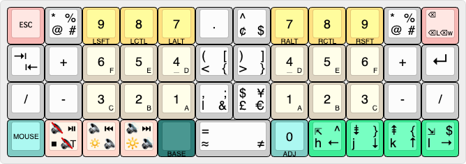

Rather than stuffing additional keys onto the left side, the Lower layer uses a mostly mirrored numpad layout so either hand can handle numeric entry and arithmetic operators. The only exception is `0`, which is right‑hand‑only.

* `A`–`F` are available by holding `1`–`6`, enabling hexadecimal input without switching layers.
* Hold `0` to get access to the **Adjustment** layer for keyboard settings.
* The bottom row largely copies **Base**, but the spacebar position outputs equality‑related symbols.
* `Num Lock` is intentionally omitted. The navigation cluster already includes all of the off‑position keys—`Home`, `Page Down`, `Page Up`, `End`, and the arrow keys—so a Windows‑style `Num Lock` toggle isn’t necessary.
* Top‑row modifiers are available for workflows that benefit from them, including [Windows Alt codes](https://en.wikipedia.org/wiki/Alt_code), [macOS Unicode Hex Input](https://en.wikipedia.org/wiki/Unicode_input), and various Linux shortcuts.

This layer can be **locked** from **Base**; hit the **HOLD** key to exit.

### Upper: Primary Number Layer

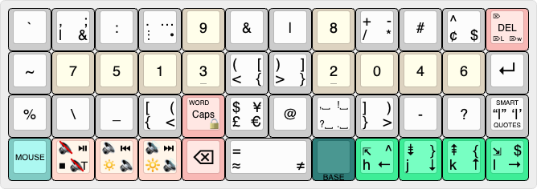

This is the workhorse layer for number and individual symbol input, except for `?`, `!`, `-`, `_`, and `\` which live on the more accessible arrow layers. I regularly use the comma–space bigram, but rely on the arrow layers for the comma itself.

This layer can be **locked** from **Base**; hit the **HOLD** key to exit.

#### Numbers

The number layout is inspired by [Programmer Dvorak’s](https://www.kaufmann.no/roland/dvorak/) arrangement, with odds on the left hand and `0` plus the evens on the right.

Notable rearrangements:

* `0`, `1` are placed under the middle fingers due to frequency.
  * `0` also jumps to the first column in Vim normal mode.
* `8`, `9` are placed on the top row to allow for parentheses on center of home row.

#### Symbols

* Parentheses, brackets, and braces are arranged symmetrically and accessed primarily with the index and middle fingers as tap dances.
* `“”` and `‘’` smart‑quote pairs insert with the cursor centered for typographic writing without relying on operating‑system auto‑substitution.
  * This lower-row key is tucked out of the way to reduce accidental activation.
* The bottom row largely copies **Base**, but the spacebar position outputs equality‑related symbols.

Above the **HELD** key sits a semantic punctuation tap‑dance key:

| Action | Behavior | Notes |
|--------|----------|-------|
| Tap | `,␣` (comma-space) | Mid-sentence separator |
| Double Tap | `!␣` (exclamation-space) | Triggers auto-capitalization |
| Tap-and-Hold | `?␣` (question-space) | Triggers auto-capitalization |
| Hold | `.␣` (period-space) | Triggers auto-capitalization |

End‑of‑sentence marks automatically capitalize the next character.

Originally, `;␣` and `:␣` bigrams were placed on this key; they were removed because they appear less frequently in prose and don’t benefit as much from semantic treatment.

The `.` key remains in the standard Dvorak position but includes additional dot‑related tap dances:

| Action | Behavior |
|--------|----------|
| Tap | `.` (dot/period) |
| Double Tap | `…` (horizontal ellipsis) |
| Tap-and-Hold | `⋮` (vertical ellipsis) |
| Hold | `•` (bullet) |
| Triple Tap | `·` (centered dot) |

The triple tap is used sparingly; the centered dot appears in mathematics and occasionally as a separator or visible‑whitespace marker, making it a good fit for a gesture that’s available but intentionally out of the way.

> [!NOTE]
> **Vertical Ellipsis**
>
> On macOS mode, the vertical ellipsis (⋮) is produced via a macro that opens the [Emoji & Symbols popover](https://support.apple.com/guide/mac-help/use-emoji-and-symbols-on-mac-mchlp1560/mac), searches for the symbol, and inserts it. This works reliably only in the default compact view; it will fail when the Expanded Character Viewer is enabled.
>
> This automation approach was chosen because the vertical ellipsis has no native keyboard shortcut and doesn’t require enabling the Unicode keyboard or using [AppleScript](https://en.wikipedia.org/wiki/AppleScript).
>
> On Linux and Microsoft Windows modes, the Unicode character is sent directly.

The `+` key provides the full set of basic arithmetic symbols on a single middle‑finger key:

| Action | Behavior |
|--------|----------|
| Tap | `+` (addition) |
| Double Tap | `-` (subraction) |
| Tap-and-Hold | `/` (division) |
| Hold | `*` (multiplication) |

#### Other Keys

* `Backspace` is placed on the left thumb key, allowing home-position access.
* Semantic `Del` is placed on the top-right key, where the analogous semantic `Backspace` is located on **Base**.

### Adjustment: Keyboard Settings

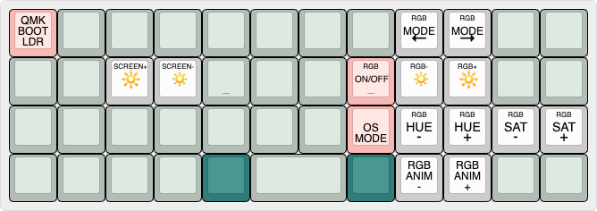

The keyboard settings layer is the least developed, and most subject to rearrangement.

The **OS Mode** key defaults to Apple macOS and cycles RGB colors:

| Color | OS |
|-------|----|
| 🔵 Blue  | Apple macOS (Default)|
| 🟢 Green | Linux |
| 🔴 Red   | Microsoft Windows |

Copy/paste/undo behavior should work properly when switching operating systems; however, virtual desktop navigation may not work, depending on your Linux desktop environment.

### Function: `F1`–`F12`

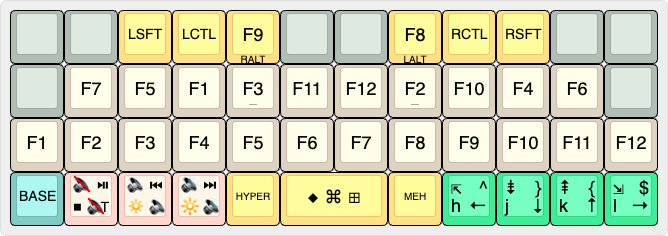

#### F-Keys

To keep layer patterns consistent, the home‑row `F1`–`F12` keys mirror the numeric structure of **Upper**. The idea is simple: the same finger positions that produce numbers on **Upper** produce function keys here. This preserves a single mental model for two different layers, reducing cognitive load.

The only exception is `F10`, since there’s no such thing as `F0`. `F11` and `F12` sit on the left and right center keys, respectively, continuing the pattern of odds on the left and evens on the right.

I briefly considered adding `F13`–`F24` for custom shortcuts using `Meh` and `Hyper`, but ultimately kept the standard `F1`–`F12` set. For users who expect a traditional layout, the lower row (Row 2) provides a familiar linear arrangement of all twelve function keys.

As a macOS user, I rarely rely on function keys, so this layer stays intentionally minimal but still easy to reach. If I spend more time on desktop Linux, I may revisit and expand this layer.


#### Modifiers

The top‑row modifiers mirror **Base**, maintaining consistency across layers. The thumb cluster provides `Hyper`, `CMD`/`Super`, and `Meh`, giving quick access to high‑chord shortcuts without awkward reaches.

### Arrows

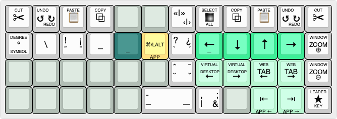

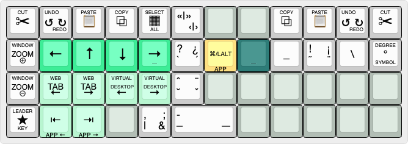

Holding either index finger on the home row activates a mirrored arrow‑navigation layer. These layers provide the most accessible versions of several high‑frequency symbols, including `,`, `-`, `_`, `?`, `!`, and `\`.

* Arrow keys sit under the active hand in Vim formation (`←`, `↓`, `↑`, `→`).
* Cut / Copy / Paste / Undo / Redo mirrored across the top row; the **HOLD**‑side is optimized for one‑hand use.
* App switching lives on the center key when held; tap `Tab` or `Shift–Tab` on the bottom row to navigate.
  * Uses `CMD` on macOS and `LALT` on Linux and Microsoft Windows.
* Zoom controls (`+`, `-`) allow quick browser scaling.
* Virtual desktop/workspace switching and browser tab navigation live on the lower row.
  * Some Linux environments may not map `Alt-Control-←/→` by default to switch workspaces.
* Leader activation is on the bottom‑corner key; see [LEADER.md](LEADER.md) for assigned mnemonic sequences.
* `?` and `!` include Spanish punctuation (`¡`, `¿`) and combining accents through tap dances for light multilingual support.
* On macOS, the combining circumflex (`ˆ`) is available in the U.S. layout, but macron (`¯`), breve (`˘`), and caron (`ˇ`) require the **ABC – Extended** input source to produce the correct dead‑key sequences.
  * For circumflex, the shortcut is `Option-i` for the U.S. layout and `Option-6` for **ABC – Extended**.
* The full dash set of hyphen (`-`), en dash (`–`), and em dash (`—`) are available on the spacebar via tap dances.
* Cursor‑centered angled‑quote macros are included for completeness in French and formal Spanish typography.

> [!TIP]
> **Apple macOS Setting**
> 
> To show the Application Switcher on all displays, run the following command in the terminal:
> 
> `defaults write com.apple.dock appswitcher-all-displays -bool true`
>
> Then restart the Dock with: `killall Dock`.[^macOS-app-switcher]

[^macOS-app-switcher]: macOS Application Switcher tip sourced from [StackOverflow](https://superuser.com/questions/670252/cmdtab-app-switcher-is-on-the-wrong-monitor).

#### English Loanwords

Tap dances on the arrow layers provide combining accents and extended punctuation, making it easy to type accented characters that appear in English [loanwords](https://en.wikipedia.org/wiki/Loanword). These words most commonly originate from French, Spanish, and German, with a smaller set from Portuguese, where only a few retain their original accents. This includes forms such as à, á, â, ä, é, í, ñ, ó, ö, ú, and others. The accessibility of accented characters reduces the need for users to memorize platform‑specific shortcuts or Unicode values.

In contemporary English writing, accented forms appear more consistently than in the past. Modern style guides and digital typography increasingly preserve the original spelling of borrowed words, especially in food, culture, and proper names. As a result, accented loanwords such as à la, à propos, vis-à-vis, voilà, café, crème brûlée, pâté, cliché, touché, résumé, déjà vu, naïve, über, doppelgänger, and jalapeño — along with place names like São Paulo and personal names like Zoë, Chloë, José, or Beyoncé — are now common in everyday text.

### Vim

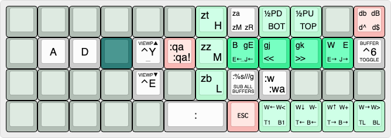

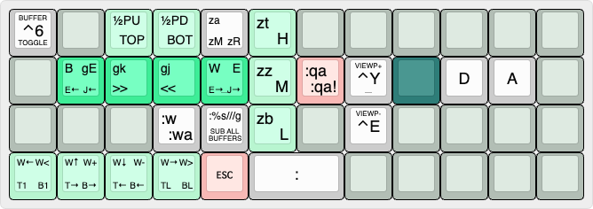

These mirrored layers are designed for use with a mostly vanilla Vim setup. The focus is on movement, navigation, and viewport adjustments to reduce editing friction and keep your hands anchored on home row.

Assigning `Esc` to the thumbs provides multiple reliable ways to reach it from home position. The deletion key in the top‑right corner follows the same semantic‑deletion philosophy as the `Backspace` and `Del` tap‑dance keys, but its motions are implemented using Vim’s native delete commands and therefore focus on word‑ and line‑level editing rather than character‑level deletion.

Vim commands that benefit from an `Esc` prefix include a built‑in delay, and command‑line macros (`:`) use an additional delay. These pauses help accommodate plugin latency and improve execution reliability. Repeatable motions that rely on count prefixes are intentionally excluded to preserve `<count>movement` behavior.

### Programming

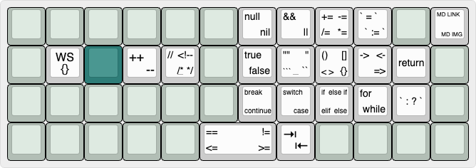

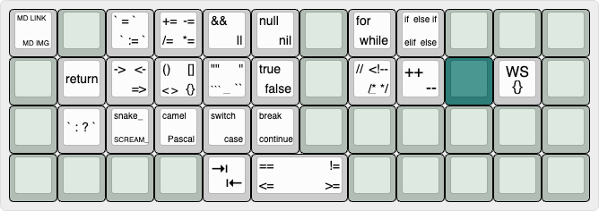

These mirrored layers provide quick access to programming‑centric symbols and structures. Quotes, parentheses, brackets, braces, comparison operators, and common control‑flow keywords are arranged near the home row for minimal travel.

The programming keywords aren’t meant to dramatically speed up coding, but they fill otherwise unused layer real estate in a fun way and make small edits more pleasant on occasion. I mostly use this layer for accessing `Tab` and `Shift‑Tab` from home position, then cursor‑centered double quotes, parentheses, brackets, and curly braces, followed by assignment operators; everything else is optional and there when I feel like getting into rhythm and shaving a few keystrokes.

I tried to choose a small, generic set of coding n‑grams that work well across a wide range of languages, mostly C‑style syntax. I also added surrounding whitespace where it makes sense to keep the output readable and consistent.

### Terminal

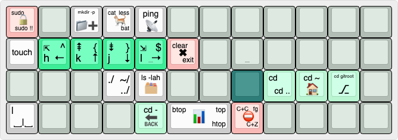

This layer centers on left‑hand navigation keys, with a handful of optional terminal‑focused macros layered in for convenience.

In practice, I mostly use the `clear`, `exit`, and `btop` macros, and occasionally the `cd` commands. The rest are there as situational helpers rather than everyday tools. The navigation keys, however, see constant use because they make home‑position movement more convenient.

As [Pascal Getreuer notes](https://getreuer.info/posts/keyboards/macros/index.html#send_string), shell aliases are generally a better solution. Between aliases, command history, and modern shell suggestions and completions ([Fish](https://fishshell.com/), [Zsh](https://github.com/zsh-users/zsh-autosuggestions)), most workflows naturally gravitate toward more efficient ways of issuing repeated commands than dedicated keyboard macros. That’s why this layer sticks to generic defaults and widely used patterns rather than trying to replicate a more complete shell workflow in firmware — it’s meant to stay lightweight and fun!

I may eventually add a few `tmux` commands here, if they complement the navigation‑first design.

### Apple macOS

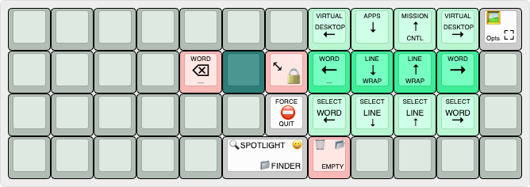

This layer centralizes macOS actions that normally require awkward reaches, multi‑key chords, or leaving the keyboard entirely. Its goal is to make common system‑level tasks feel as fluid and low‑effort as text editing or navigation. Spotlight search, the emoji picker, Finder controls, screenshot tools, window management, and Trash operations all land in predictable positions that don’t break flow.

Word and line movement follow the expected Vim pattern.

Eventually, I’ll make a similar desktop Linux layer, with the **HOLD** on the opposite center key. This may be more challenging due to the wide variety of desktop environments and window managers, each with its own keyboard‑shortcut conventions.

### Mouse

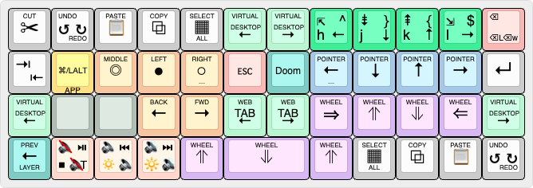

This layer is meant for short bursts of pointer use or as a fallback when a wireless mouse, trackball, or trackpad disconnects. It lets you make quick adjustments — selecting text, clicking UI elements, manipulating windows — without leaving home position.

Moving your hand to activate this layer isn’t ideal, so it’s primarily triggered with the **left palm**. I recommend using a taller keycap (such as an SA‑profile Row 3) to make activation more ergonomic and reliable.

I arranged the keys to make the learning curve as gentle as possible: **pointer movement** on the right, the main five **mouse buttons** on the left, and **scroll wheel** on the lower row and thumb cluster. This keeps everything predictable and easy to train. I also placed the navigation cluster, workspace switching, and tab movement here to provide a full range of movement tools on a single layer.

The only minor downsides are the need for two‑hand operation and the practice required to get fully comfortable with mouse‑key accuracy. For example, pressing two directional keys produces diagonal movement, which takes a little time to internalize. With practice, muscle memory takes over and it becomes surprisingly natural. (I still prefer a finger trackball as my primary pointing device, but this layer is invaluable when the rechargeable battery goes flat, especially on a desktop.)

### Doom Classic

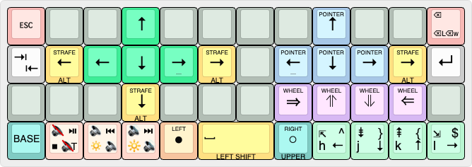

And finally, the most important question: can the Planck play _Doom_? It sure does!

This layer is an optional game‑focused mode built around vanilla _Doom_ (1993) ports. It replaces the typing layout with a tight movement cluster, dedicated strafing keys, and thumb‑accessible actions so your hands never leave position during play. Arrow and strafe keys sit under the left hand, while Left Click, Right Click, Space, and Shift live on the thumbs for fast firing, opening doors, and running.

Weapon switching stays consistent with the rest of your layout: holding the right‑thumb key momentarily opens **Upper**, letting you press `1`–`7` without adding number keys to this layer.

Arrows and mouse controls also make this layer usable for lightweight general navigation, using traditional T‑shaped clusters.

This layer serves as a generic gaming template that you can refactor into your preferred control scheme.

## RGB Matrix for the Planck MIT

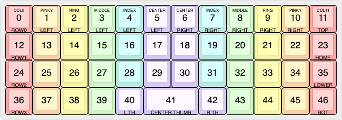

The image above shows the physical LED numbering used by QMK’s RGB Matrix system for the Planck MIT. These indices are fixed by the PCB and firmware, so having a visual reference makes it easier to target specific LEDs when writing animations, effects, or per‑key lighting. In this project, the diagram serves as the basis for defining per‑layer RGB patterns.

To make the layout easier to work with, this project uses a semantic naming scheme that maps each LED index to a meaningful constant. Instead of remembering that LED 17 is “left‑hand middle‑column, second row,” you can refer to it by the name `LED_ROW1_LEFT_CENTER`.

The bottom row doesn’t map perfectly to finger usage, but for consistency the naming pattern is applied uniformly.

> [!NOTE]
> Throughout these documents, the rows are generally referred to as **top**, **home**, **lower**, and **bottom**.

#### Naming Scheme

The constants use zero‑based indexing and correspond one‑to‑one with the physical LED positions defined in [rgb.h](/src/features/rgb.h).

Main 4×12 grid LEDs, grouped by row, side, and ergonomic column:

```c
// LED_ROW<0–3>_<LEFT/RIGHT>_<INDEX/MIDDLE/RING/PINKY/CENTER>

// Top Row
#define LED_ROW0_LEFT_PINKY   1
#define LED_ROW0_LEFT_RING    2
#define LED_ROW0_LEFT_MIDDLE  3
#define LED_ROW0_LEFT_INDEX   4
#define LED_ROW0_LEFT_CENTER  5

#define LED_ROW0_RIGHT_CENTER 6
#define LED_ROW0_RIGHT_INDEX  7
#define LED_ROW0_RIGHT_MIDDLE 8
#define LED_ROW0_RIGHT_RING   9
#define LED_ROW0_RIGHT_PINKY  10
⋮
```

The four outer‑edge LEDs on the far left and right columns:

```c
// LED_ROW<1–2>_<COL0/COL11>

// Home Row
#define LED_ROW1_COL0         12
#define LED_ROW1_COL11        23

// Lower Row
#define LED_ROW2_COL0         24
#define LED_ROW2_COL11        35
```

The four corner LEDs:

```c
// LED_CORNER_<TOP/BOTTOM>_<LEFT/RIGHT>

// Top Row
#define LED_CORNER_TOP_LEFT   0
#define LED_CORNER_TOP_RIGHT  11

// Bottom Row
#define LED_CORNER_BOTTOM_LEFT  36
#define LED_CORNER_BOTTOM_RIGHT 46
```

The thumb cluster:

```c
// LED_THUMB_<LEFT/CENTER/RIGHT>

#define LED_THUMB_LEFT        40
#define LED_THUMB_CENTER      41 // Spacebar
#define LED_THUMB_RIGHT       42
```

### Per-Layer RGB

For this project, layers with static RGB patterns are designed to indicate which layer is currently active. Only the most relevant keys are illuminated for each layer, providing a clear visual cue without overwhelming the layout.

Keys highlighted in red represent actions with higher consequence — such as deletion, exiting, or indicating that `Caps Lock` is active.

When `Caps Lock` is active, the **Base** layer is illuminated with a blinking red pattern to provide an immediate, unmistakable visual indicator. When the one‑shot `Shift` key is active, the **Base** layer shifts to a golden yellow to reflect the modified typing state.

When the **Adjustment** layer is active, per‑layer RGB is suspended whenever an RGB‑related key is pressed, ensuring changes are immediately visible. After about three seconds of inactivity, per‑layer RGB automatically resumes.

> [!TIP]
> To turn the **Base** layer’s lighting off while keeping per‑key effects active, lower the RGB brightness while in the **Adjustment** layer.
