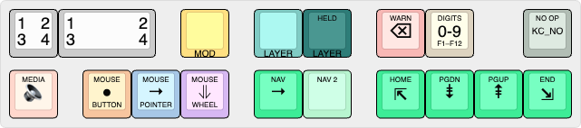

# 🌌 Spacecentricity — A Planck MIT Keymap for the Inland MK-47

Spacecentricity is a maximalist modal keymap built around a modified Dvorak base, heavy thumb usage, and mirrored layers for navigation, Vim‑style editing, and programming. It emphasizes home‑position access to high‑frequency characters and movement keys — arrows, numbers, symbols, and common programming n‑grams — through macros and tap dances. Key redundancy provides alternative ways to perform the same actions, helping reduce strain and fatigue.

Each layer includes its own RGB matrix pattern, making it easy to see which layer is active at a glance.

> [!NOTE]
> See [design notes](DESIGN.md) for deeper explanations of key placement and layer philosophy.

## Keyboard

The [Inland MK-47](https://www.microcenter.com/product/661264/inland-47-keys-hot-swappable-rgb-wired-mechanical-keyboard) is an affordable **47‑key ortholinear mechanical keyboard** sold by Micro Center. Despite its low price, it includes features normally found on enthusiast‑grade boards:

* [QMK-compatible firmware](https://qmk.fm/) (fully programmable)
* Per‑key RGB lighting
* Hot‑swappable switch sockets
* USB‑C wired connection

The MK‑47 has become a popular entry‑level option for people interested in experimenting with custom firmware, unusual layouts, or switch testing without spending much. Its compact footprint also makes it a convenient one‑piece travel or backup board — it even fits neatly inside a Nintendo Switch carrying case, which makes it easy to throw in a bag. Some users also repurpose the Planck form factor as a macropad.

### Availability

The MK‑47 is typically an in‑store Micro Center exclusive, but it’s occasionally available for shipping within the U.S. depending on stock. If you don’t live near a Micro Center, checking eBay and similar marketplaces is often worthwhile, as units show up there fairly regularly.

> [!TIP]
> Not familiar with Planck keyboards? See this brief [video by Jack Humbert](https://www.youtube.com/watch?v=bEPg8kk84gw) introducing the Planck.

## Layout

Each layer is presented as a rendered diagram generated with [keyboard-layout-editor.com](https://keyboard-layout-editor.com) for quick visual reference.

> [!IMPORTANT]
> On macOS, this keymap is designed to be used with the **ABC – Extended** input source. Other layouts may alter how Option‑based characters or dead‑key sequences behave, leading to inconsistent output. Apple provides this input source for English‑language users who need a more complete set of diacritical marks and international symbols without switching to a separate language layout. This input source does not interfere with standard system shortcuts.
>
> Because Linux and Microsoft Windows accept Unicode directly from [HID](https://en.wikipedia.org/wiki/Human_interface_device), the standard US layout works correctly when the keyboard is used in those modes.

### Legend



This keymap uses QMK’s [quad‑tap dance pattern](https://docs.qmk.fm/features/tap_dance), allowing up to four distinct actions per key:

| Position | Action |
|----------|--------|
| **1** | Tap |
| **2** | Double Tap |
| **3** | Tap-and-Hold |
| **4** | Hold |

> [!NOTE]
> Triple‑tap actions are supported but not shown in the diagram because they are used only for rare or “deep‑storage” functions. When a key includes a triple‑tap action, it is mentioned in that key’s description.

> [!NOTE]
> See the [README](assets/README.md) for hex color values in the [`assets/`](assets/) directory.

### Base: Modified Dvorak


Most layer keys are momentary holds.

The **Lower** and **Upper** keys behave the same, but you can **lock** them with tap‑and‑hold and **unlock** with a tap back to Base.

#### `Backspace` Key

The top-right corner key is a semantic `Backspace`, available on multiple layers:

| Action | Behavior | Notes |
|--------|----------|-------|
| Tap | Delete previous character | Sends `Backspace` |
| Tap-and-Hold | Delete to beginning of line | Implemented as `LSFT‑LCTL‑Left` → `Backspace` |
| Hold | Delete previous word |  macOS: `LALT-Backspace`; Linux/Windows: `LCTL-Backspace` |

#### Access to Mouse & Function Keys

The **bottom‑left corner key** toggles special modes:

| Action | Behavior |
|--------|----------|
| Tap | **Mouse** Layer |
| Hold (≈350 ms or longer) | **Function** layer (`F1`–`F12`) |

This key is not momentary — it switches layers rather than holding them.

#### Media Cluster

The media cluster lives out of the way on the bottom left. Note that  **Mute Tab** (`Ctrl‑M` on hold) works in Firefox and Firefox‑based browsers, but not in most Chromium‑based browsers. Screen‑brightness controls sit on Tap‑and‑Hold for convenient access from the top layer.

### Lower: Numpad


Tap the **HELD** key when this layer is **locked** to return to **Base**.

Hold `1`–`6` for hexadecimal `A`–`F`.

Momentary hold `0` to access **Adjustment** layer to change keyboard settings.

### Upper: Primary Number Layer


Tap the **HELD** key when this layer is **locked** to return to **Base**.

Activating **Caps Lock** turns this key — and the entire **Base** layer — red for visual feedback. When active, **Base** will blink to make the state more noticeable.

#### `Del` Key

The top-right corner key provides a forward delete, analogous to the **Base** layer’s semantic `Backspace`:

| Action | Behavior | Notes |
|--------|----------|-------|
| Tap | Delete next character | Sends `Del` |
| Tap-and-Hold | Delete to end of line | Implemented as `LSFT‑LCTL‑Right` → `Del` |
| Hold | Delete next word |  macOS: `LALT‑Del`; Linux/Windows: `LCTL‑Del` |

#### Semantic Punctuation

Directly above the **HELD** key lives a prose‑oriented semantic punctuation key. It emits punctuation‑space bigrams, and for sentence‑ending marks it automatically capitalizes the next alphabetic character.

| Action | Behavior | Notes |
|--------|----------|-------|
| Tap | `,␣` (comma-space) | Mid-sentence separator |
| Double Tap | `!␣` (exclamation-space) | Triggers auto-capitalization |
| Tap-and-Hold | `?␣` (question-space) | Triggers auto-capitalization |
| Hold | `.␣` (period-space) | Triggers auto-capitalization |

#### Special Characters

Smart quotes live on the lower row, inserting paired curly quotes with the cursor centered for fancy, typographic writing. Tap for double smart quotes; hold for single smart quotes. Use these macros if you prefer not to rely on OS‑ or app‑level substitutions.

The `.` key remains in the standard Dvorak position but includes additional dot‑related tap dances:

| Action | Behavior |
|--------|----------|
| Tap | `.` (dot/period) |
| Double Tap | `…` (horizontal ellipsis) |
| Tap-and-Hold | `⋮` (vertical ellipsis) |
| Hold | `•` (bullet) |
| Triple Tap | `·` (centered dot) |

> [!NOTE]
> On macOS mode, the **vertical ellipsis** (⋮) has no direct keyboard shortcut and is produced with a macro that uses compact the [Emoji & Symbols popover](https://support.apple.com/guide/mac-help/use-emoji-and-symbols-on-mac-mchlp1560/mac). On Linux and Microsoft Windows modes, the Unicode character is sent directly.

### Adjustment: Keyboard Settings


The **OS MODE** key switches the keyboard’s active operating‑system profile. It adjusts copy/paste behavior, special symbol mappings, and virtual desktop/workspace navigation to match the selected OS.

The backlight color indicates which OS is currently active:

| Color | OS |
|-------|----|
| 🔵 Blue  | Apple macOS (Default)|
| 🟢 Green | Linux |
| 🔴 Red   | Microsoft Windows |

> [!WARNING]
> Linux and Microsoft Windows behavior is currently untested!
> 
> I’m unlikely to test Windows myself, but the functionality is included for completeness.

### Function: `F1`–`F12`


Provides `F1`–`F12` and modifier combinations for shortcut execution. The home and top rows mirror the **Upper** layer’s number layout, and the lower row includes a redundant, standard linear layout for familiarity and ease of use.

### Arrows


Spanish punctuation and combining diacritics sit on the home row for light multilingual support.

**Center Keys**

| Action | Behavior |
|--------|----------|
| Tap | `?` |
| Double Tap | `¿` |
| Tap-and-Hold | `ˋ` (combining grave) |
| Hold | `´` (combining acute) |

**Ring-Finger Keys**

| Action | Behavior |
|--------|----------|
| Tap | `!` |
| Double Tap | `¡` |
| Tap-and-Hold | `˜` (combining tilde) |
| Hold | `¨` (combining umlaut) |

**Lower Row Accent Keys**

| Action | Behavior |
|--------|----------|
| Tap | `ˆ` (combining circumflex) |
| Double Tap | `¯` (combining macron) |
| Tap-and-Hold | `˘` (combining breve) |
| Hold | `ˇ` (combining caron) |

> [!WARNING]
> On macOS, the lower row combining marks rely on the **ABC – Extended** input source. Other layouts do not provide the required dead‑key sequences and will produce incorrect output.

**Application Switching**

Hold the center key to activate the application switcher. macOS uses `CMD`; Linux and Microsoft Windows uses `LALT`.

Tap `Tab` or `Shift–Tab` on the bottom row to navigate.

### Vim


These layers provide ergonomic access to common Vim navigation, window management, and viewport‑control commands, optimized for modal editing.

Movements that interact with counts (`<number>movement`) intentionally omit the `Esc` prefix to preserve numeric prefixes and avoid breaking repeatable motions.

**Home Row Navigation Cluster**

| Action | Behavior |
|--------|----------|
| Tap | Move backward/forward by **WORD**; move down/up in a **wrapped line** |
| Double Tap | Jump to end of previous/next **WORD** |
| Tap-and-Hold | Navigate backward/forward through the **edit list** |
| Hold | Navigate backward/forward through the **jump list**; **unindent/indent** current line |

WORD and wrapped‑line motions omit the `Esc` prefix to maintain compatibility with `<count>`‑prefixed movements.

**Bottom Row Navigation Cluster**

| Action | Behavior |
|--------|----------|
| Tap | Change active **window split** (left / down / up / right) |
| Double Tap | Resize active **window split** (decrease width / decrease height / increase height / increase width) |
| Tap-and-Hold | Switch active **tab** (first / previous / next / last) |
| Hold | Switch active **buffer** (first / previous / next / last) |

Window‑resize commands omit the `Esc` prefix to preserve compatibility with `<count>`‑based resizing.

**Center Navigation Cluster**

| Actions | Behavior |
|---------|----------|
| Tap | `zt`, `zz`, `zb` (scroll viewport to top / center / bottom) |
| Hold | `H`, `M`, `L` (move cursor to top / middle / bottom of screen) |

**Semantic Deletion Key**

| Action | Behavior | Notes |
|--------|----------|-------|
| Tap | `db` (delete previous word) | Moves right one column to mimic standard OS word‑deletion behavior |
| Double Tap | `dB` (delete previous WORD) | Also includes the right‑movement for consistency |
| Tap-and-Hold | `d^` (delete to beginning of line) | Deletes everything back to the first non‑whitespace character |
| Hold | `d$` (delete to end of line) | Deletes everything to the right of (and under) the cursor |

**Folds**

| Actions | Behavior |
|---------|----------|
| Tap | `za` (toggle fold under cursor)
| Tap-and-Hold | `zM` (close all folds in buffer) |
| Hold | `zR` (open all folds in buffer) |

### Programming


Paired characters (quotes, brackets, braces) automatically place the cursor inside. This is the primary purpose of the layer, since these keys sit directly under the home row. However, many editors and IDEs already provide similar behavior, so this layer is optional.

C-style programming keywords and operators are included for completeness, and many n‑grams insert with smart spacing before and/or after to match typical coding style and reduce keystrokes.

### Terminal


An optional convenience layer centered on left‑hand navigation (`Home`, `Page Up`, `Page Down`, `End` under the home row) and a handful of shell‑adjacent shortcuts. The “terminal keys” are intentionally lightweight — more for comfort and fun than necessity — since shell history, aliases, and muscle memory usually handle most workflows.

### Apple macOS


The **center-thumb key** (spacebar) opens core macOS functionality:

| Action | Behavior |
|--------|----------|
| Tap | Toggle [Spotlight Search](https://en.wikipedia.org/wiki/Spotlight_(Apple)) |
| Double Tap | Toggle [Emoji & Symbols Menu](https://support.apple.com/guide/mac-help/use-emoji-and-symbols-on-mac-mchlp1560/mac) |
| Hold | Open [Finder](https://en.wikipedia.org/wiki/Finder_(software)) |

The **right‑thumb key** provides quick file‑deletion actions:

| Action | Behavior |
|--------|----------|
| Tap | Delete selected item(s) |
| Double Tap | Open the Trash folder in Finder |
| Hold | Empty the Trash (Finder); open clear browser data menu (Firefox, Chromium) |

The **top‑right corner key** handles screen-capture shortcuts:

| Action | Behavior |
|--------|----------|
| Tap | Partial screenshot |
| Tap-and-Hold | Opens all screenshot options |
| Hold | Full screenshot (all displays) |

The **center key** provides window and device controls:

| Action | Behavior |
|--------|----------|
| Tap | Toggle application full-screen mode |
| Hold | Lock Mac / iDevice |

### Mouse


This layer is typically accessed with a _left‑palm tap_ on **Base**, using a taller keycap (flat SA Row 3) for easier targeting while keeping the hands in home position for quick entry and exit.

### Doom Classic


An optional compact gaming layer modeled after vanilla _Doom_ (1993), built around a tight movement cluster, dedicated strafing keys, and thumb‑based actions for firing, opening doors, and running. Quick weapon switching is handled through the **Upper** layer, and the layout also works as a simple arrows‑plus‑mouse‑keys mode using traditional T‑shaped clusters for general navigation.

## Using This Keymap with QMK

This keymap is maintained _outside_ the QMK source tree. To use it, create a symbolic link inside your local QMK checkout so QMK can see it as a normal keymap.

### 🧲 Download the Keymap Source Code

```bash
mkdir -p ~/your/preferred/path/      # Optional: create a directory
cd ~/your/preferred/path/
git clone https://github.com/LittleWalter/spacecentricity-mk47
```

### 🔗 Create the Symlink

```bash
cd ~/qmk_firmware/keyboards/inland/mk47/keymaps    # Inland MK-47 keymaps path
ln -s /path/to/this/planck/repo <your-keymap-name> # link the repo
```

#### Example

```bash
ln -s ~/projects/mk47-spacecentricity \
      ~/qmk_firmware/keyboards/inland/mk47/keymaps/spacecentricity
```

### 🏭 Build

```bash
qmk compile -kb inland/mk47 -km spacecentricity
```

### ⚡️ Flash

```bash
qmk flash -kb inland/mk47 -km spacecentricity
```

> [!TIP]
> To enter bootloader mode and install the new firmware, hold the **top-left key** down while plugging the keyboard in. Alternatively, press the key assigned to `QK_BOOTLOADER`/`QK_BOOT` on the keymap.

### 🔧 Helper Scripts (Optional)

This repo includes small POSIX‑compliant scripts in `scripts/` that automate common tasks, including:

* Creating and removing the symlink in your QMK checkout
* Building and flashing the keymap
* Cleaning previous build artifacts
* Checking QMK paths and symlink status

These scripts are entirely optional — the build script simply wraps QMK’s CLI — but they streamline common workflows if you prefer a single‑command interface and want to reduce repetitive steps and cognitive overhead.

> [!NOTE]
> For details on available scripts and how to use them, see the
[README](scripts/README.md) in `scripts/`.

## ⚠️ Layout Stability

This keymap is actively maintained and may evolve over time as layouts, layers, and features are refined, added, or removed.

Most layers are fairly stable at this point, but some of the more specialized/optional ones (such as **Terminal** and **Programming**) may be reworked, consolidated, or removed as the design continues to mature.

This keymap has not been tested on Linux or Microsoft Windows operating systems.