# 🌌 Spacecentricity — A Planck MIT Keymap for the Inland MK-47

Spacecentricity is a maximalist modal keymap built around a modified Dvorak base, mirrored layers for navigation, Vim‑style editing/programming, and common OS/application actions. It emphasizes home-position access (with heavy thumb usage) to high-frequency characters, movement keys, numbers, symbols, and common [programming n-grams](#programming) through [macros](https://docs.qmk.fm/feature_macros) and [tap dances](https://docs.qmk.fm/features/tap_dance). Key redundancy provides alternative ways to perform the same actions, helping reduce strain and fatigue.

Because this keymap treats keyboard firmware like a [finite-state machine](https://en.wikipedia.org/wiki/Finite-state_machine), each layer includes its own RGB matrix pattern, making it easy to see which layer or state is active at a glance. The RGB matrix indicates active modes such as Caps Lock (blinking red), One-Shot Shift (gold), [Case Modes](#case-modes-temporary-lexical-modes) (neon mint), and [Leader](/LEADER.md) sequences (navy blue).

This keymap has an estimated user count of one.

[](https://qmk.fm/)
[](LICENSE)
[](https://github.com/LittleWalter/spacecentricity-mk47/commits/main)
[](CHANGELOG.md)
[](https://octocounts.com/github/LittleWalter/spacecentricity-mk47/tree/main)
[](https://octocounts.com/github/LittleWalter/spacecentricity-mk47/tree/main)
[](https://octocounts.com/github/LittleWalter/spacecentricity-mk47/tree/main)

> [!NOTE]
> See [design notes](DESIGN.md) for deeper explanations of key placement and layer philosophy.

## Table of Contents

- [The Keyboard](#the-keyboard)
  - [Inside the Box](#inside-the-box)
  - [Availability](#availability)
- [Layout: Userland Layers](#layout-userland-layers)
  - [Legend](#legend)
  - [Core Layers](#core-layers)
    - [Base: Modified Dvorak](#base-modified-dvorak)
    - [Upper: Primary Number Layer](#upper-primary-number-layer)
    - [Arrows](#arrows)
  - [Support Layers](#support-layers)
    - [Lower: Numpad](#lower-numpad)
    - [Adjustment: Keyboard Settings](#adjustment-keyboard-settings)
    - [Function: `F1`–`F12`](#function-f1f12)
  - [Specialized Layers](#specialized-layers)
    - [Operating System Modes](#operating-system-modes)
      - [Apple macOS](#apple-macos)
    - [Vim](#vim)
    - [Programming](#programming)
    - [Terminal](#terminal)
    - [Mouse](#mouse)
    - [_Doom_ (1993)](#doom-1993)
- [Case Modes: Temporary Lexical Modes](#case-modes-temporary-lexical-modes)
- [Using This Keymap with QMK](#using-this-keymap-with-qmk)
  - [Helper Scripts (Optional)](#-helper-scripts-optional)
- [Layout Stability](#-layout-stability)

## The Keyboard

The [Inland MK-47](https://www.microcenter.com/product/661264/inland-47-keys-hot-swappable-rgb-wired-mechanical-keyboard) is an affordable **47-key ortholinear mechanical keyboard** sold by Micro Center and a clone of the [OLKB](https://olkb.com/) Planck. Despite its low price, it includes features usually reserved for enthusiast-grade boards:

* [QMK-compatible firmware](https://qmk.fm/) (fully programmable)
* [VIA](https://www.caniusevia.com/) support for on-the-fly keymap editing
* Per-key RGB lighting
* USB-C wired connection (💭 Remember when keyboards typically had fixed cables?)
* Hot-swappable MX switch sockets (📌 3/5-pin)
* Compact size, ideal for lap or tray table use
* Retail price of $39.99 USD (2026)

The MK-47 has become a popular entry point for anyone experimenting with custom firmware, unusual layouts, or switch testing without spending much. Its compact footprint makes it a convenient one-piece travel or backup board — it even fits neatly inside a Nintendo Switch carrying case, so it's easy to throw in a bag.

One thing that would make it even more travel-friendly: built-in Bluetooth and/or 2.4 GHz wireless support. That said, sticking to a single wired connection is simpler than wired split keyboards, which often require both a USB-C and a [TRRS](https://www.zsa.io/voyager/our-cables) ("tip-ring-ring-sleeve") cable — and it likely keeps the MK-47’s price down, too.

### Inside the Box

The MK-47 is usable out of the box (aside from its stock keymap).

* 47× Huano Red Linear MX-style switches — 3-pin, 45g actuation (2mm pre-travel), 60g bottom-out, 4.0mm travel
  * **Authenticity:** surprisingly decent 🍒 clones
* 44× shine-through white keycaps
  * **Material:** probably ABS plastic
  * **Shape:** OEM-like profile (❓ maybe similar to Cherry profile)
  * **Labels:** QWERTY primary labels w/ smaller secondary labels
* 3× shine-through black keycaps
  * **`Esc`:** black, 1u (top row/`ROW0`)
  * **`Enter`:** black, 1u (home row/`ROW1`)
  * **`Space`:** black, 2u, a.k.a. the “spacebar” (bottom row/`ROW3`)
* 1× black plastic case w/ **width×depth:** 235×83mm (9.25×3.27in)
  * **Angle:** 3–5° positive tilt
  * **Mount type:** tray/top-mounted PCB (6× small Philips screws, accessible after removing the keycaps)
  * **No stock foam:** standoffs leave room inside for adding sound-dampening material
* 1× Planck MIT-style PCB
  * **Switch sockets:** MX hotswap (📌 3/5-pin compatible)
  * **RGB LEDs:** North-facing
  * **MCU:**  Westberry Tech. [`WB32FQ95xx`](https://www.westberrytech.com/uploads/file/WB32FQ95xx/EN_RM2905025_WB32FQ95xx_V01.pdf), Arm® 32-bit Cortex-M3
    * **Chip ID:** `0x3A50E980`
  * **Flash size:** 256 KB (🌌 plenty of space to work with)
  * **SRAM size:** 36 KB
  * **Port(s):** USB-C (USB 2.0)[^usb-magnetic-adapters]
* Accessories & extras
  * 1× funky black nylon braided 90° USB-C-to-USB-A cable
  * 1× keycap puller included (w/o switch puller)
  * 1× paper manual that tries to trick you into using the preinstalled keymap
* **Stock keyboard weight:** 345g (≈0.76 lb)
* **Approx. total weight (w/ case & accessories):** ≈567g (≈1.25 lb)

[^usb-magnetic-adapters]: Consider a magnetic USB-C adapter to reduce wear from repeated plug/unplug cycles, especially during travel.

### Availability

The MK‑47 is typically an in‑store Micro Center exclusive, but it’s occasionally available for shipping within the U.S. depending on stock. If you don’t live near a Micro Center, checking eBay and similar marketplaces is often worthwhile, as units show up fairly regularly.

> [!TIP]
> Not familiar with Planck keyboards? See this brief [video by Jack Humbert](https://www.youtube.com/watch?v=bEPg8kk84gw) introducing the Planck.

## Layout: Userland Layers

Each layer is presented as a rendered diagram generated with [keyboard-layout-editor.com](https://keyboard-layout-editor.com) for quick visual reference.

> [!IMPORTANT]
> On macOS, this keymap is designed to be used with the **ABC – Extended** input source. Other layouts may alter how Option‑based characters or dead‑key sequences behave, leading to inconsistent output. Apple provides this input source for English‑language users who need a more complete set of diacritical marks and international symbols without switching to a separate language layout. This input source does not interfere with standard system shortcuts.
>
> Because Linux and Microsoft Windows accept Unicode directly from [HID](https://en.wikipedia.org/wiki/Human_interface_device), the standard US layout should work correctly when the keyboard is used in those modes — though this is largely untested on my end.

> [!TIP]
> [**Base**](#base-modified-dvorak), [**Upper**](#upper-primary-number-layer), and [**Arrows**](#arrows) are the most frequently used layers. Most of the remaining layers and state mechanics exist to assist workflow rather than get in the way — the [**Mouse**](#mouse) layer, for example, comes in handy when the battery dies on a wireless pointing device. [Leader](/LEADER.md) sequences can be toggled on/off via the [**Adjustment**](#adjustment-keyboard-settings) layer.

### Legend

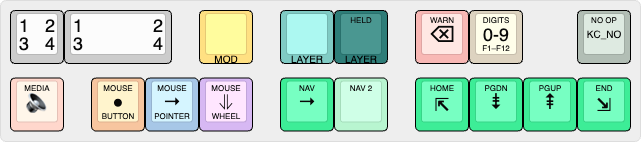

This keymap uses QMK’s [quad‑tap dance pattern](https://docs.qmk.fm/features/tap_dance), allowing up to four distinct actions per key:

| Position | Action |
|----------|--------|
| **1** | Tap |
| **2** | Double Tap |
| **3** | Tap-and-Hold |
| **4** | Hold |

> [!NOTE]
> Triple‑tap actions are supported but not shown in the diagram because they are used only for rare or “deep‑storage” functions. When a key includes a triple‑tap action, it is mentioned in that key’s description.

> [!NOTE]
> See the [README](assets/README.md) for hex color values in the [`assets/`](assets/) directory.

### Core Layers

The top three layers that make up the everyday typing environment:

1. [**Base**](#base-modified-dvorak) — primary alpha layout (modified [Dvorak Simplified](https://en.wikipedia.org/wiki/Dvorak_keyboard_layout))
2. [**Upper**](#upper-primary-number-layer) — home row numbers (`ROW1`, [Programmer Dvorak](https://www.kaufmann.no/roland/dvorak/)-inspired), symbols, and secondary characters
3. [**Arrows**](#arrows) — navigation, editing, common symbols (`,`, `_`, `!`, `\`, etc.), and frequently used diacritics

#### Base: Modified Dvorak

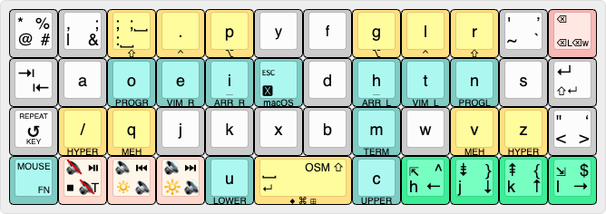

Most layer keys are momentary holds.

The [**Lower**](#lower-numpad) and [**Upper**](#upper-primary-number-layer) keys behave the same, but you can **lock** them with tap‑and‑hold and **unlock** with a tap back to **Base**.

##### `Backspace` Key

The top-right corner key is a semantic `Backspace`, available on multiple layers:

| Action | Behavior | Notes |
|--------|----------|-------|
| Tap | Delete previous character | Sends `Backspace` |
| Tap-and-Hold | Delete to beginning of line | Implemented as `LSFT‑LCTL‑Left` → `Backspace` |
| Hold | Delete previous word |  macOS: `LALT-Backspace`; Linux/Microsoft Windows: `LCTL-Backspace` |

##### `Esc` Key

| Action | Behavior | Notes |
|--------|----------|-------|
| Tap | `Esc` ||
| Tap-and-Hold | Close Active Window | macOS: `CMD‑W`; Linux/Microsoft Windows: `Alt-F4` |
| Hold | Momentary Layer [**Operating System**](#operating-system-modes) | Switches to the appropriate operating-system layer while held; returns to **Base** on release |

##### Access to Mouse & Function Keys

The **bottom‑left corner key** toggles special modes:

| Action | Behavior |
|--------|----------|
| Tap | Activates [**Mouse**](#mouse) layer |
| Hold (≈350 ms or longer) | Activates [**Function**](#function-f1f12) layer (`F1`–`F12`) |

This key is not momentary — it switches layers rather than holding them.

##### Media Cluster

The Media keys live on the left-hand side of the bottom row (`ROW3`), out of the way, but easily accessible.

| Action | Behavior |
|--------|----------|
| Tap | Mute, Volume Down, Volume Up |
| Double Tap | Play/Pause, Previous Track, Next Track |
| Tap-and-Hold | Stop, Screen Brightness Down, Screen Brightness Up |
| Hold | Mute Tab (`LCTL-M` for Firefox), Volume Down, Volume Up (repeats while held) |

> [!WARNING]
> Mute Tab (`LCTL-M`) works in Firefox and Firefox-based browser, but not in most Chromium-based browsers.

##### Special Characters

The `*` key emits `×`(multiplication, not the letter _x_) on triple tap.

The navigation cluster emits the arrow symbols on triple tap: `←`, `↓`, `↑`, `→`.

#### Upper: Primary Number Layer

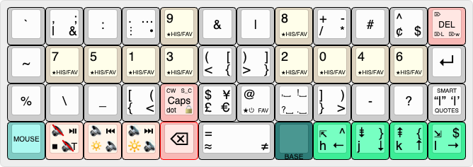

Tap the **HELD** key when this layer is **locked** to return to [**Base**](#base-modified-dvorak).

##### Caps Key

The Caps key provides three related text-entry modes, each with its own visual indicator on the [**Base**](#base-modified-dvorak) layer:

| Action | Behavior | Base RGB | Notes |
|--------|----------|----------|-------|
| Tap | Activates `Caps Word` | 🟡 Golden yellow | Auto‑disables after 5 seconds of inactivity |
| Double Tap | Toggle `SCREAMING_SNAKE_CASE` | 🟢 Neon mint | Auto‑disables after 5 seconds of inactivity |
| Tap-and-Hold | Toggle `dot.case` | 🟢 Neon mint | Auto‑disables after 5 seconds of inactivity |
| Hold | Toggle `Caps Lock` | 🔴 Blinking red | Must be manually turned off |

> [!TIP]
> `Caps Word` temporarily capitalizes letters as you type and automatically turns itself off at the end of the word, making it ideal for acronyms, identifiers, and short uppercase sequences without toggling `Caps Lock`.
>
> `SCREAMING_SNAKE_CASE` behaves similarly to `Caps Word`, but transforms the spacebar into `_` and is intended for constant identifiers commonly used in C‑style languages and shell environments.
>
> `dot.case` works similarly: it transforms the spacebar into `.` and is primarily useful for naming long files.

##### `Del` Key

The top-right corner key provides a forward delete, analogous to the [**Base**](#base-modified-dvorak) layer’s semantic `Backspace`:

| Action | Behavior | Notes |
|--------|----------|-------|
| Tap | Delete next character | Sends `Del` |
| Tap-and-Hold | Delete to end of line | Implemented as `LSFT‑LCTL‑Right` → `Del` |
| Hold | Delete next word |  macOS: `LALT‑Del`; Linux/Windows: `LCTL‑Del` |

##### Semantic Punctuation

Directly above the **HELD** key lives a prose‑oriented semantic punctuation key. It emits punctuation‑space bigrams, and for sentence‑ending marks it automatically capitalizes the next alphabetic character.

| Action | Behavior | Notes |
|--------|----------|-------|
| Tap | `,␣` (comma-space) | Mid-sentence separator |
| Double Tap | `!␣` (exclamation-space) | Triggers auto-capitalization |
| Tap-and-Hold | `?␣` (question-space) | Triggers auto-capitalization |
| Hold | `.␣` (period-space) | Triggers auto-capitalization |

##### Special Characters

Smart quotes live on the lower row, inserting paired curly quotes with the cursor centered for fancy, typographic writing. Tap for double smart quotes; hold for single smart quotes. Use these macros if you prefer not to rely on OS‑ or app‑level substitutions.

The `.` key remains in the standard Dvorak position but includes additional dot‑related tap dances:

| Action | Behavior |
|--------|----------|
| Tap | `.` (dot/period) |
| Double Tap | `…` (horizontal ellipsis) |
| Tap-and-Hold | `⋮` (vertical ellipsis) |
| Hold | `•` (bullet) |
| Triple Tap | `·` (centered dot) |

Additional triple‑tap symbols: `+` → `×` (multiplication, not the letter _x_), `[` → `≤`, `]` → `≥`.

> [!NOTE]
> On macOS mode, the **vertical ellipsis** (⋮) has no direct keyboard shortcut and is produced with a macro that uses compact the [Emoji & Symbols popover](https://support.apple.com/guide/mac-help/use-emoji-and-symbols-on-mac-mchlp1560/mac). On Linux and Microsoft Windows modes, the Unicode character is sent directly.

##### Leader Replay

This keymap includes optional Leader Replay support, allowing you to repeat recent or favorited Leader actions using holds of the number keys (`0`–`9`).

Replay functionality can be enabled or disabled with the `@` toggle key, and the same key also switches between _History_ and _Favorites_ replay modes.

See [LEADER.md](/LEADER.md) for full details.

#### Arrows

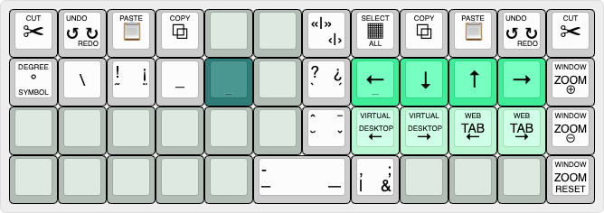

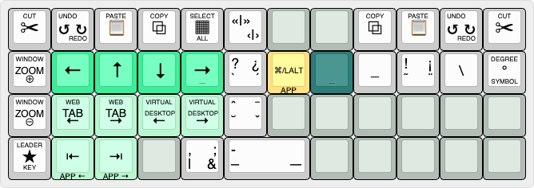

Spanish punctuation and combining diacritics sit on the home row for light multilingual support.

The bottom-left corner key activates mnemonic Leader sequences. See [LEADER.md](/LEADER.md) for the full list of available actions.

**Center Keys**

| Action | Behavior |
|--------|----------|
| Tap | `?` |
| Double Tap | `¿` |
| Tap-and-Hold | `ˋ` (combining grave) |
| Hold | `´` (combining acute) |

**Ring-Finger Keys**

| Action | Behavior |
|--------|----------|
| Tap | `!` |
| Double Tap | `¡` |
| Tap-and-Hold | `˜` (combining tilde) |
| Hold | `¨` (combining umlaut) |

**Lower Row Accent Keys**

| Action | Behavior |
|--------|----------|
| Tap | `ˆ` (combining circumflex) |
| Double Tap | `¯` (combining macron) |
| Tap-and-Hold | `˘` (combining breve) |
| Hold | `ˇ` (combining caron) |

> [!WARNING]
> On macOS, the lower row combining marks rely on the **ABC – Extended** input source. Other layouts do not provide the required dead‑key sequences and will produce incorrect output.

**Application Switching**

Hold the center key to activate the application switcher. macOS uses `CMD`; Linux and Microsoft Windows uses `LALT`.

Tap `Tab` or `Shift–Tab` on the bottom row to navigate.

### Support Layers

These layers are still useful, just less frequently accessed than the [Core Layers](#core-layers).

#### Lower: Numpad

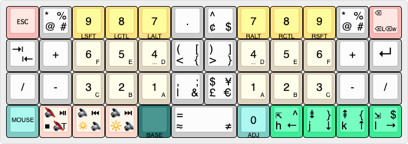

Tap the **HELD** key when this layer is **locked** to return to [**Base**](#base-modified-dvorak).

Hold `1`–`6` for hexadecimal `A`–`F`.

Momentary hold `0` to access [**Adjustment**](#adjustment-keyboard-settings) layer to change keyboard settings.

#### Function: `F1`–`F12`

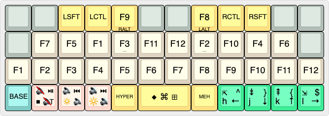

Provides `F1`–`F12` and modifier combinations for shortcut execution. The home and top rows mirror the [**Upper**](#upper-primary-number-layer) layer’s number layout, and the lower row includes a redundant, standard linear layout for familiarity and ease of use.

#### Adjustment: Keyboard Settings

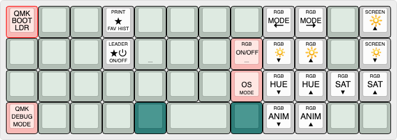

The **OS MODE** key switches the keyboard’s active operating‑system profile. It adjusts copy/paste behavior, special symbol mappings, and virtual desktop/workspace navigation to match the selected OS.

The backlight color indicates which OS is currently active:

| Color | OS |
|-------|----|
| 🔵 Blue  | Apple macOS (Default)|
| 🟢 Green | Linux |
| 🔴 Red   | Microsoft Windows |

> [!WARNING]
> Linux and Microsoft Windows behavior is currently untested!
>
> I’m unlikely to test Windows myself, but the functionality is included for completeness.

### Specialized Layers

These optional layers extend the core environment for specific workflows.

#### Operating System Modes

By default, this keyboard is set to [Apple macOS](#apple-macos); switch it to Linux or Microsoft Windows via the [**Adjustment**](#adjustment-keyboard-settings) layer.

##### Apple macOS

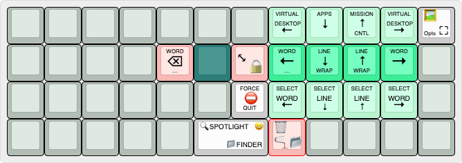

The **center-thumb key** (spacebar) opens core macOS functionality:

| Action | Behavior |
|--------|----------|
| Tap | Toggle [Spotlight Search](https://en.wikipedia.org/wiki/Spotlight_(Apple)) |
| Double Tap | Toggle [Emoji & Symbols Menu](https://support.apple.com/guide/mac-help/use-emoji-and-symbols-on-mac-mchlp1560/mac) |
| Hold | Open [Finder](https://en.wikipedia.org/wiki/Finder_(software)) |

The **right‑thumb key** provides quick file‑deletion actions:

| Action | Behavior |
|--------|----------|
| Tap | Delete selected item(s) |
| Tap-and-Hold | Empty the Trash (Finder); open clear browser data menu (Firefox, Chromium) |
| Hold | Open the Trash folder in Finder |

The **top‑right corner key** handles screen-capture shortcuts:

| Action | Behavior |
|--------|----------|
| Tap | Partial screenshot |
| Tap-and-Hold | Opens all screenshot options |
| Hold | Full screenshot (all displays) |

The **center key** provides window and device controls:

| Action | Behavior |
|--------|----------|
| Tap | Toggle application full-screen mode |
| Hold | Lock Mac / iDevice |

#### Vim

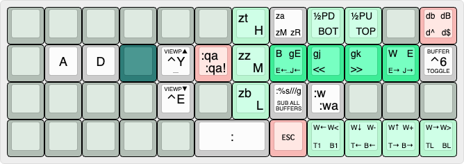

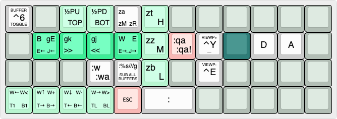

These layers provide ergonomic access to common Vim navigation, window management, and viewport‑control commands, optimized for modal editing.

Movements that interact with counts (`<number>movement`) intentionally omit the `Esc` prefix to preserve numeric prefixes and avoid breaking repeatable motions.

**Home Row Navigation Cluster**

| Action | Behavior |
|--------|----------|
| Tap | Move backward/forward by **WORD**; move down/up in a **wrapped line** |
| Double Tap | Jump to end of previous/next **WORD** |
| Tap-and-Hold | Navigate backward/forward through the **edit list**; **unindent/indent** current line |
| Hold | Navigate backward/forward through the **jump list** |

WORD and wrapped‑line motions omit the `Esc` prefix to maintain compatibility with `<count>`‑prefixed movements.

**Bottom Row Navigation Cluster**

| Action | Behavior |
|--------|----------|
| Tap | Change active **window split** (left / down / up / right) |
| Double Tap | Resize active **window split** (decrease width / decrease height / increase height / increase width) |
| Tap-and-Hold | Switch active **tab** (first / previous / next / last) |
| Hold | Switch active **buffer** (first / previous / next / last) |

Window‑resize commands omit the `Esc` prefix to preserve compatibility with `<count>`‑based resizing.

**Center Navigation Cluster**

| Action | Behavior |
|---------|----------|
| Tap | `zt`, `zz`, `zb` (scroll viewport to top / center / bottom) |
| Hold | `H`, `M`, `L` (move cursor to top / middle / bottom of screen) |

**Semantic Deletion Key**

| Action | Behavior | Notes |
|--------|----------|-------|
| Tap | `db` (delete previous word) | Moves right one column to mimic standard OS word‑deletion behavior |
| Double Tap | `dB` (delete previous WORD) | Also includes the right‑movement for consistency |
| Tap-and-Hold | `d^` (delete to beginning of line) | Deletes everything back to the first non‑whitespace character |
| Hold | `d$` (delete to end of line) | Deletes everything to the right of (and under) the cursor |

**Folds**

| Action | Behavior |
|---------|----------|
| Tap | `za` (toggle fold under cursor)
| Tap-and-Hold | `zM` (close all folds in buffer) |
| Hold | `zR` (open all folds in buffer) |

#### Programming

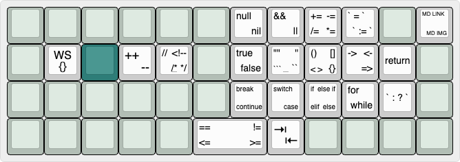

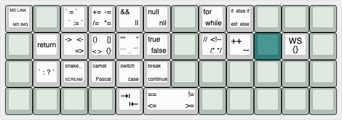

Paired characters (quotes, brackets, braces) automatically place the cursor inside. This is the primary purpose of the layer, since these keys sit directly under the home row. Many editors and IDEs already provide similar behavior, so this layer is optional.

C‑style programming keywords and operators are included for completeness. Many n‑grams insert with smart spacing before and/or after to match typical coding style and reduce keystrokes.

The `camelCase` / `PascalCase` and `snake_case` / `SCREAMING_SNAKE_CASE` keys toggle temporary [case modes](#case-modes-temporary-lexical-modes).

#### Terminal

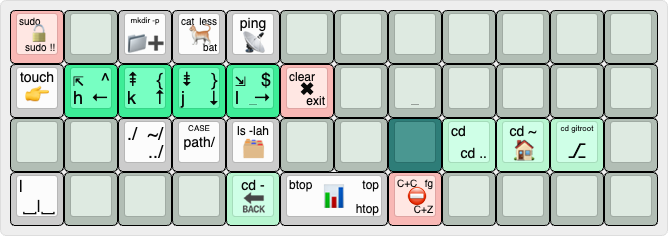

An optional convenience layer centered on left‑hand navigation (`Home`, `Page Up`, `Page Down`, `End` under the home row) and a handful of shell‑adjacent shortcuts. The “terminal keys” are intentionally lightweight — more for comfort and fun than necessity — since shell history, aliases, and muscle memory usually handle most workflows.

#### Mouse

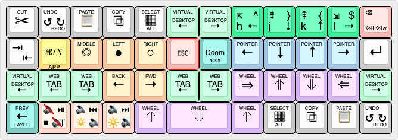

This mouse layer is typically accessed with a _left-palm tap_ from [**Base**](#base-modified-dvorak). A taller keycap (flat SA Row 3) makes the key easier to target while keeping the hands in home position for quick entry and exit.

This layer serves as a secondary/fallback mouse input, useful when other pointing devices are unavailable or for mouse-driven terminal emulator interaction.

#### _Doom_ (1993)

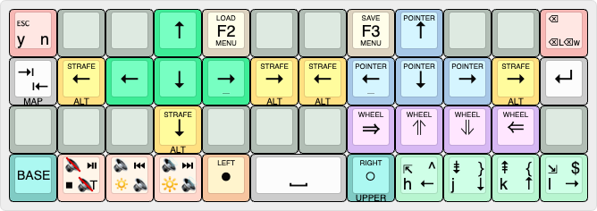

An optional compact gaming layer modeled after vanilla [_Doom_ (1993)](https://en.wikipedia.org/wiki/Doom_(1993_video_game)), built around a tight movement cluster, dedicated strafing keys, and thumb‑based actions for firing and opening doors. Quick weapon switching is handled through the [**Upper**](#upper-primary-number-layer) layer and dedicated left-hand keys, and the layout also works as a simple arrows‑plus‑mouse‑keys mode using traditional T‑shaped clusters for general navigation.

> [!IMPORTANT]
> Tested w/ [Chocolate Doom](https://www.chocolate-doom.org/wiki/index.php/Chocolate_Doom) v3.1.1 but keyboard settings modified for `previous weapon` and `next weapon` using `0` and `1`, respectively. It’s also a good idea to enable “Always run” to eliminate the need to continuously hold `Shift`.
>
> On macOS, `Pause` (and `F15`) triggers `screen-brightness-up`, so this keymap binds the in-game Pause action to `Delete`.[^Pause_and_Scroll_Lock_on_macOS]
>
> `RUN:` `chocolate-doom-setup`
>
> `GOTO:` `Configure Keyboard` → `Action` → `More Controls…` → Set `Previous weapon` to `1`, Set `Next weapon` to `0`, set `Weapon 1` to `Weapon 8` starting at `2`
>
> `GOTO:` `Configure Keyboard` → `Misc.` → Select `Always run`
>
> If using macOS `GOTO:` `Configure Keyboard` → `Other keys…` → `- Shortcut keys -` → Set `Pause game` to `Delete`

> [!TIP]
> Refer to the [instruction manual scan](assets/Classic_Doom_manual_screenshot-controls.jpg) for _Doom_ (1993) default controls.[^doom_1993_instruction_manual]

[^doom_1993_instruction_manual]: _Doom_ (1993) instruction manual scan sourced from [gaming.stackexchange.com](https://gaming.stackexchange.com/questions/363261/what-are-the-original-controls-of-doom-1993).

[^Pause_and_Scroll_Lock_on_macOS]: On macOS, `Pause` and `F15` → `screen-brightness-up`; `Scroll Lock` and `F14` → `screen-brightness-down`.

## Case Modes: Temporary Lexical Modes

Often referred to as “case modes,” these lightweight, real‑time text‑transformation modes modify characters _as you type_, without rewriting existing text or relying on editor plugins. They’re designed for programming, documentation/prose, and command‑line workflows, and each mode automatically disables after a short period of inactivity (5 seconds).

The spacebar applies the correct separator or capitalization for the mode, and it automatically exits Caps Word and One-Shot Shift.

| Mode | Description | Typical Use |
| --- | --- | --- |
| Caps Word | Capitalizes a single word; mirrors [QMK’s built‑in behavior](https://docs.qmk.fm/features/caps_word) | Acronyms, constants |
| One‑Shot Shift | Capitalizes or shifts the next character; mirrors [QMK’s built-in behavior](https://docs.qmk.fm/one_shot_keys) | Prose, documentation |
| `camelCase` | Ignores separators and capitalizes the next letter | Java, JavaScript, Go, JSON |
| `PascalCase` | Like camelCase, but capitalizes the first letter | Types, classes |
| `snake_case` | Converts separators into ``_`` | Python, Rust, C identifiers |
| `SCREAMING_SNAKE_CASE` | Uppercase `snake_case` | Constants, env vars |
| `kebab-case` | Converts separators into ``-`` | Filenames, URLs, CLI flags |
| `dot.case` | Converts separators into ``.`` | Filenames, namespaces, config keys |
| `path/to/case` | Converts separators into ``/`` | File paths, imports |

Exit these temporary modes earlier with a control or modifier key.

> [!TIP]
> Hold the `Space` key on [**Base**](#base-modified-dvorak) to turn off case modes.

## Using This Keymap with QMK

This keymap is maintained _outside_ the QMK source tree. To use it, create a symbolic link inside your local QMK checkout so QMK can see it as a normal keymap.

### 🧲 Download the Keymap Source Code

```bash
mkdir -p ~/your/preferred/path/      # Optional: create a directory
cd ~/your/preferred/path/
git clone https://github.com/LittleWalter/spacecentricity-mk47
```

### 🔗 Create the Symlink

```bash
cd ~/qmk_firmware/keyboards/inland/mk47/keymaps    # Inland MK-47 keymaps path
ln -s /path/to/this/planck/repo <your-keymap-name> # link the repo
```

#### Example

```bash
ln -s ~/projects/mk47-spacecentricity \
      ~/qmk_firmware/keyboards/inland/mk47/keymaps/spacecentricity
```

### 🏭 Build

```bash
qmk compile -kb inland/mk47 -km spacecentricity
```

### ⚡️ Flash

```bash
qmk flash -kb inland/mk47 -km spacecentricity
```

> [!TIP]
> To enter bootloader mode and install the new firmware, hold the **top-left key** down while plugging the keyboard in. Alternatively, press the key assigned to `QK_BOOTLOADER`/`QK_BOOT` on the keymap.

### 🔧 Helper Scripts (Optional)

This repo includes small [POSIX](https://en.wikipedia.org/wiki/POSIX)‑compliant scripts in [`scripts/`](./scripts) that automate common tasks, including:

* Creating and removing the symlink in your QMK checkout
* Building and flashing the keymap
* Cleaning previous build artifacts
* Checking QMK paths and symlink status

These scripts are entirely optional — the build script simply wraps QMK’s CLI — but they streamline common workflows if you prefer a single‑command interface and want to reduce repetitive steps and cognitive overhead.

> [!NOTE]
> For details on available scripts and how to use them, see the [README](./scripts/README.md) in [`scripts/`](./scripts) or run the available scripts w/ the `-h`/`--help` flags.

## ⚠️ Layout Stability

This keymap is actively maintained and may evolve over time as layouts, layers, and features are refined, added, or removed.

Most layers are fairly stable at this point, but some of the more specialized/optional ones (such as [**Adjustment**](#adjustment-keyboard-settings), [**Terminal**](#terminal), and [**Programming**](#programming)) may be reworked, consolidated, or removed as the design continues to mature.

This keymap has not been tested on Linux or Microsoft Windows operating systems.
